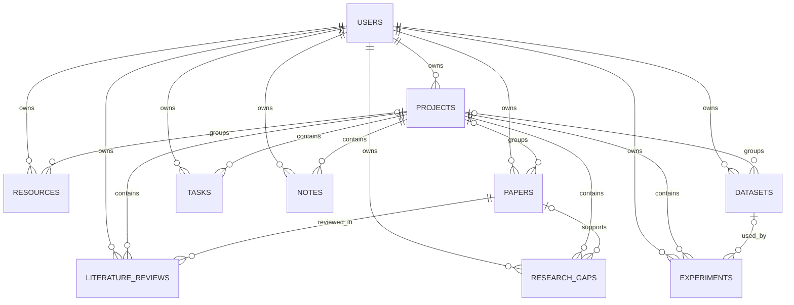

# ResearchFlow Hub - Database Design

## Step 4 status

The Version 1 database design is complete. It was prepared during Step 4 and later imported successfully into Oracle MySQL 8.0.46 during Step 5. No application or CRUD code was added.

## Database settings

- Database: `researchflow_db`
- Engine: InnoDB
- Character set: `utf8mb4`
- Collation: `utf8mb4_unicode_ci`
- Schema file: `database/schema.sql`

## Tables

| Table | Purpose | Main parent relationships |
| --- | --- | --- |
| `users` | Authentication and profile data | Root table |
| `projects` | Research project workspaces | Belongs to `users` |
| `resources` | General academic resources | Belongs to `users`; optionally to `projects` |
| `papers` | Detailed research paper metadata | Belongs to `users`; optionally to `projects` |
| `datasets` | Dataset metadata and links | Belongs to `users`; optionally to `projects` |
| `literature_reviews` | Structured reviews used by the review matrix | Belongs to `users`, `projects`, and `papers` |
| `research_gaps` | Gaps and gap-dashboard data | Belongs to `users` and `projects`; optionally to `papers` |
| `experiments` | ML/DL configurations and stored metrics | Belongs to `users` and `projects`; optionally to `datasets` |
| `tasks` | Project tasks and progress data | Belongs to `users` and `projects` |
| `notes` | Project-linked research notes | Belongs to `users` and `projects` |

Citation output is generated from `papers`; comparison, matrix, dashboard, statistics, filters, sorting, pagination, and search are derived from these tables and do not need separate storage tables.

## Entity relationships

## Delete behaviour

| Deleted parent | Result |
| --- | --- |
| User | All records owned by that user are deleted with `ON DELETE CASCADE`. |
| Project | Resources, papers, and datasets remain but become unassigned. Reviews, gaps, experiments, tasks, and notes are deleted. |
| Paper | Its literature reviews are deleted; related gaps remain and become unlinked. |
| Dataset | Related experiments remain and become unlinked. |

All destructive application actions must still use POST, CSRF verification, authentication, ownership checks, and confirmation. Database cascades do not replace those controls.

## Controlled values

- Project status: `planned`, `ongoing`, `completed`, `archived`.
- Resource type: research paper, dataset, GitHub repository, website, book, research tool, documentation, pretrained model, course, tutorial, or other.
- Resource status: `saved`, `to_read`, `reading`, `completed`, `important`.
- Paper reading status: `to_read`, `reading`, `reviewed`, `completed`, `important`.
- Dataset access: `public`, `restricted`, `credentialed`, `private`, `unknown`.
- Dataset status: `identified`, `requested`, `approved`, `downloaded`, `preprocessed`, `used`, `archived`.
- Gap type: dataset, methodological, performance, validation, explainability, multimodal, privacy, generalization, computational, clinical validation, or other.
- Gap priority: `low`, `medium`, `high`, `critical`.
- Gap status: `identified`, `investigating`, `addressed`, `rejected`.
- Task priority: `low`, `medium`, `high`, `urgent`.
- Task status: `pending`, `in_progress`, `completed`, `cancelled`.
- Note type: `general`, `idea`, `meeting`, `experiment`, `paper`, `dataset`, `important`.

## Integrity and validation rules

- Email is unique; passwords store hashes only.
- Project target dates and task deadlines cannot precede their start dates.
- Dataset counts cannot be negative.
- Experiment metrics are optional and, when supplied, must be between 0 and 1.
- Experiment splits are either all omitted or all supplied, each is 0-100, and their total must be approximately 100.
- Learning rate, batch size, and epochs must be positive when supplied.
- Foreign keys and filter/sort indexes support the required modules, dashboards, comparisons, and lists.
- PHP must validate URLs, dates, years, required fields, and all controlled values again; database checks are a second layer.
- Every private query must include the authenticated `user_id`. Before saving a submitted project, paper, or dataset ID, PHP must verify that the related record belongs to the same user.

## Step 4 checkpoint

- [x] All 10 PDF-defined Version 1 tables are included.
- [x] Primary keys, foreign keys, delete rules, timestamps, and indexes are defined.
- [x] Required statuses, types, priorities, dates, metrics, and ownership fields are represented.
- [x] The ER relationship map is documented.
- [x] No credentials, sample users, fake records, or database connection code were added.
- [x] The schema was not executed during Step 4; its later Step 5 import is documented in `docs/database-setup.md`.
